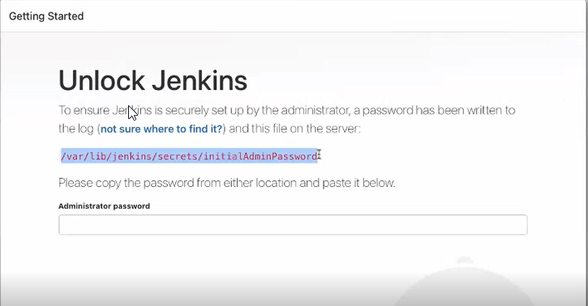
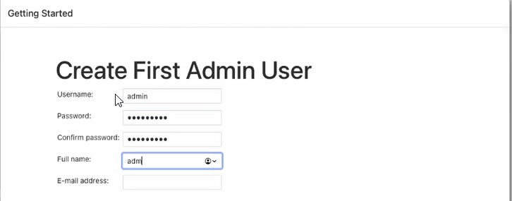
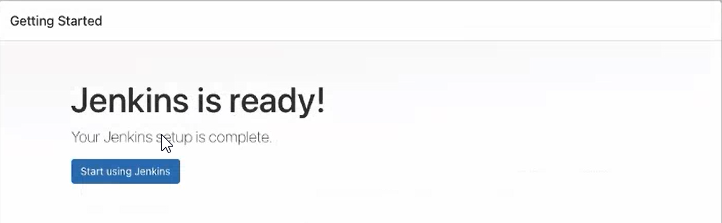
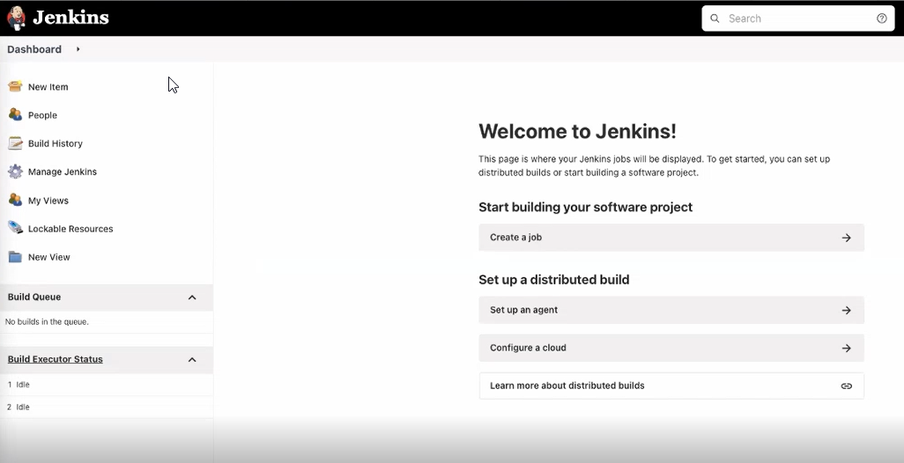
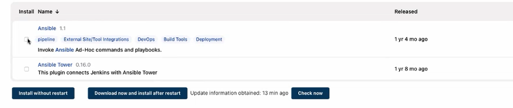
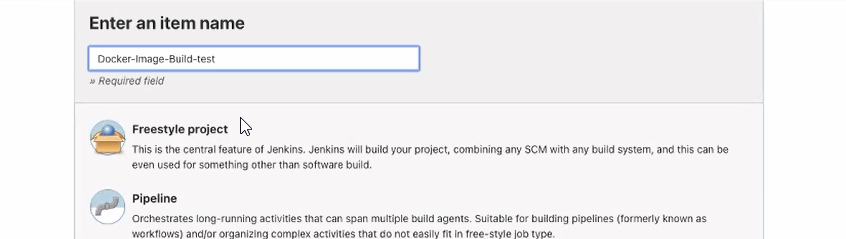

# jenkins-ansible-docker-project

## Description:-

This is a DevOps CI/CD pipeline using Git, Jenkins, Ansible and Docker on AWS for deploying a python-flask application in a Docker container.The process should be initiated from a new commit to a specific branch of a GitHub repository. This event kicks off a process that begins building the Docker image. Jenkins supports this event-driven flow using the “GitHub hook trigger for GITScm polling".

## Architecture


## Setup
1. CI/CD Server
2. Docker Image Build Server
3. Production/Test Server

Here we use amazon linux on these 3 servers.

## CI/CD Server

> One server is with Jenkins and other two servers are test and build

## Jenkins Installation and configuration. 
```
amazon-linux-extras install epel -y
yum install java-1.8.0-openjdk-devel -y
wget -O /etc/yum.repos.d/jenkins.repo https://pkg.jenkins.io/redhat-stable/jenkins.repo
rpm --import https://pkg.jenkins.io/redhat-stable/jenkins.io.key
yum install jenkins git ansible -y
systemctl start jenkins.service
systemctl enable jenkins.service
```
> After the instalation, we can test the jenkins using the below port:
```
http://13.233.16.92:8080/
```

## Let setup the playbook on ansible master server:

```
]# cat /var/deployment/hosts
[build]
172.31.15.203  ansible_user="ec2-user"


[test]
172.31.0.93 ansible_user="ec2-user"
```
```
# vim /var/deployment/hosts
# chmod o=--- /var/deployment/
# chown jenkins /var/deployment/
# ls -ld /var/deployment/
# drwxr-x--- 2 jenkins root 35 Mar 10 11:31 /var/deployment/

# ansible-vault encrypt /var/deployment/main.yml
New Vault password:
Confirm New Vault password:
Encryption successful
#
# ls -l /var/deployment/
-rw-r--r-- 1 root root    96 Mar 10 11:31 hosts
-rw------- 1 root root 16490 Mar 10 11:35 main.yml
# chmod 644 /var/deployment/main.yml
```

## Ansible Playbook

> main.yml
```
---
- name: "Building docker image on 'Build' server from Git repo"
  hosts: build
  become: true
  vars:
    packages:
      - docker
      - git
      - python-pip
    git_repo_url: "https://github.com/jomyg/devops-flask.git"
    clone_dir: "/var/flask_app/"
    docker_user: jomyg
    docker_pass: **********
    image_name: jomyg/flask

  tasks:

    - name: "Build - Installing docker, pip & git"
      yum:
        name: "{{ packages }}"
        state: present

    - name: "Build - Adding ec2-user to docker group"
      user:
        name: "ec2-user"
        groups:
          - docker
        append: true

    - name: "Build - Installing python2 extension For Docker"
      pip:
        name: docker-py

    - name: "Buid- Restarting/Enabling Docker service"
      service:
        name: docker
        state: restarted
        enabled: true

    - name: "Build - Clonning Repo {{ git_repo_url }}"
      git:
        repo: "{{ git_repo_url }}"
        dest: "{{ clone_dir }}"
      register: clone_status

    - name: "Build - Loging into Docker-hub"
      when: clone_status.changed == true
      docker_login:
        username: "{{ docker_user }}"
        password: "{{ docker_pass }}"
        state: present
            
    - name: "Build - Creating docker image and pushing to docker hub"
      when: clone_status.changed == true
      docker_image:
        source: build
        build:
          path: "{{ clone_dir }}"
          pull: yes
        name: "{{ image_name }}"
        tag: "{{ item }}"
        push: true
        force_tag: yes
        force_source: yes
      with_items:
        - "{{ clone_status.after }}"
        - latest  

    - name: "Build - Deleting pulled images from build server"
      when: clone_status.changed == true
      docker_image:
        state: absent
        name: "{{ image_name }}"
        tag: "{{ item }}"
      with_items:
        - "{{ clone_status.after }}"
        - latest

    - name: "Build -Logout from docker hub"
      when: clone_status.changed == true
      docker_login:
        username: "{{ docker_user }}"
        password: "{{ docker_pass }}"
        state: absent

- name: "Pulling builded image and running container on 'Test' server"
  hosts: test
  become: true
  vars:
    docker_image: "jomyg/flask"
    packages:
      - docker
      - python-pip

  tasks:

    - name: "Test - Installing docker and pip "
      yum:
        name: "{{ packages }}"
        state: present

    - name: "Test - Adding ec2-user to docker group"
      user:
        name: "ec2-user"
        groups:
          - docker
        append: true

    - name: "Test - Installing python2 extension For Docker"
      pip:
        name: docker-py

    - name: "Test - Restarting/Enabling Docker service"
      service:
        name: docker
        state: restarted
        enabled: true
        
    - name: "Test - Pulling Docker image"
      docker_image:
        name: "{{ docker_image }}"
        source: pull
        force_source: yes
      register: image_status      
    
    - name: "Test - Running container"
      when: image_status.changed == true     
      docker_container:
        name: flaskapp
        image: "{{ docker_image }}:latest"
        recreate: yes
        published_ports:
          - "80:5000"

    - name: "Email alert"
      when: image_status.changed == true
      mail:
        host: smtp.gmail.com
        port: 587
        secure: starttls 
        username: ******@gmail.com
        password: ********************       --------------------------------->app password
        to: jomyg <*****@gmail.com>
        subject: Project Notification
        body: New Github code commit found. Image builed and tested.
```

## Configuring Jenkins
> After the jenkins installation take the admin password from jenkins server using the below path:
```
ec2-user]# cat /var/lib/jenkins/secrets/initialAdminPassword
<pass>
```
> Unlock the jenkins and install the suggested plugins:

<center> </img></center>

<center> </img></center>

<center> </img></center>

<center> </img></center>


> Go to Manage jenkins -> Manage plugins -> Availble plugins -> Search for ansible and slect the ansible 1.1 and install without restart.

<center> </img></center>

> After installtion above was completed. Select the restart the when jenkins is completed the installtion. It will restart the jenkins.
> After restart, go to Manage jenkins -> Global tool cofiguration -> Ansible -> Add ansible -> provide the path of exec dir "/bin" -> save
> Lets create a job, Go to New item -> provide a job name and select "Free style project" -> Click Ok

<center> </img></center>

> It will ask a series of question: Provide description and select source code as GIT.
> Provide the git repo url of jenkins and provide the correct branch of your git
> Add build step as "Invoke ansible playbook"
> Provide the playbook path as "/var/deployment/main.yml"
> Add the inventory file under "File or host list" as "/var/deployment/hosts"
> Add the ssh key with private key too for the build and test server
> Add the ansible vault password with jenkins to access the playbook
> Disable the host ssh key check too.
> Save the settings

Jenkins manual Build

Once the Job is created, click on "Build now" and check the Console Output and verify everything is fine.
For this, add the Jenkins Payload URL in GitHub repository's Webhook,

> Go back to Jenkins dashboard and select the job and build now to deploy.

## Jenkins output
```
Started by user admin
Running as SYSTEM
Building in workspace /var/lib/jenkins/workspace/Docker-git-push-and-build
The recommended git tool is: NONE
No credentials specified
 > git rev-parse --resolve-git-dir /var/lib/jenkins/workspace/Docker-git-push-and-build/.git # timeout=10
Fetching changes from the remote Git repository
 > git config remote.origin.url https://github.com/jomyg/git-flask-app.git # timeout=10
Fetching upstream changes from https://github.com/jomyg/git-flask-app.git
 > git --version # timeout=10
 > git --version # 'git version 2.32.0'
 > git fetch --tags --force --progress -- https://github.com/jomyg/git-flask-app.git +refs/heads/*:refs/remotes/origin/* # timeout=10
 > git rev-parse refs/remotes/origin/master^{commit} # timeout=10
Checking out Revision 1c27f271c0695430f542ffb3f80abc25140fff36 (refs/remotes/origin/master)
 > git config core.sparsecheckout # timeout=10
 > git checkout -f 1c27f271c0695430f542ffb3f80abc25140fff36 # timeout=10
Commit message: "Update app.py"
 > git rev-list --no-walk 1c27f271c0695430f542ffb3f80abc25140fff36 # timeout=10
[Docker-git-push-and-build] $ /bin/ansible-playbook /var/deployment/main.yml -i /var/deployment/hosts -f 5 --private-key /tmp/ssh3723965158513822939.key -u ec2-user --vault-password-file /var/lib/jenkins/workspace/Docker-git-push-and-build/vault3726674399113858515.password

PLAY [Building Docker Image and container from GITHUB] *************************

TASK [Gathering Facts] *********************************************************

ok: [172.31.35.248]

TASK [Check if docker is installed] ********************************************
changed: [172.31.35.248]

TASK [Execute script if docker is not installed] *******************************
skipping: [172.31.35.248]

TASK [We are Installing pip & git] *********************************************
ok: [172.31.35.248]

TASK [Build - Adding Ec2-user to docker group for access] **********************
ok: [172.31.35.248]

TASK [Build - Installing Python Extension For Docker ansible communication] ****
ok: [172.31.35.248]

TASK [Build - Restarting and Enabling Docker Service] **************************
ok: [172.31.35.248]

TASK [Build - Clonning Repo https://github.com/jomyg/git-flask-app.git to /var/flaskapp/] ***
ok: [172.31.35.248]

TASK [Build - Accessing the offical docker hub account] ************************
skipping: [172.31.35.248]

TASK [Build - Creating docker image and pusing to your docker hub now. Please wait] ***
skipping: [172.31.35.248] => (item=1c27f271c0695430f542ffb3f80abc25140fff36) 
skipping: [172.31.35.248] => (item=latest) 

TASK [Build - Deleting unused local images from build server] ******************
skipping: [172.31.35.248] => (item=1c27f271c0695430f542ffb3f80abc25140fff36) 
skipping: [172.31.35.248] => (item=latest) 

TASK [Build - sign out form docker hub.] ***************************************
skipping: [172.31.35.248]

PLAY [Running pulled image on staging server] **********************************

TASK [Gathering Facts] *********************************************************

ok: [172.31.38.176]

TASK [Test server - Installing Packages] ***************************************
ok: [172.31.38.176]

TASK [Test server - Adding Ec2-user to docker group for access] ****************
ok: [172.31.38.176]

TASK [Test server- Installing python extension for docker communication] *******
ok: [172.31.38.176]

TASK [Test server - Docker restart and enable] *********************************
ok: [172.31.38.176]

TASK [Test server- Pulling Docker image from docker hub now. Please wait] ******
ok: [172.31.38.176]

TASK [Test server - Container is creating. Please wait] ************************
skipping: [172.31.38.176]

PLAY RECAP *********************************************************************
172.31.35.248              : ok=7    changed=1    unreachable=0    failed=0    skipped=5    rescued=0    ignored=0   
172.31.38.176              : ok=6    changed=0    unreachable=0    failed=0    skipped=1    rescued=0    ignored=0   

Finished: SUCCESS
```

## Result

A new image is pushed to Docker Hub from the 'Build' host, which is pulled by 'Test' host to create a Docker Container.


